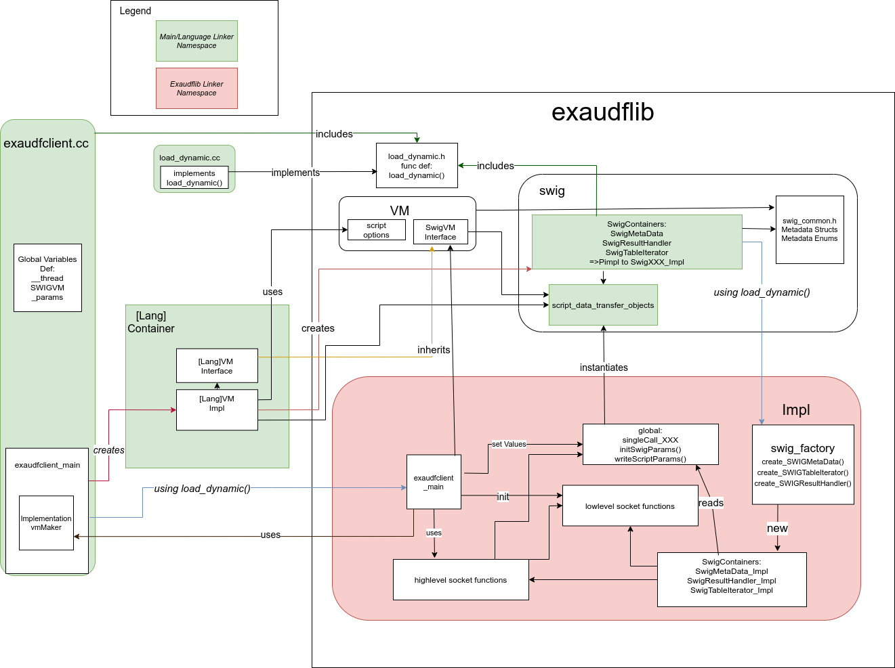

# What is the udf-runner-cpp?

The udf-runner-cpp connects to the database via [ZeroMQ](http://zeromq.org/) and fetches the tuples which then get processed by the user-defined functions (UDFs). This repository contains the C++ runner, the benchmark and streaming VM support.

# How to build the udf-runner-cpp?

## Prerequisites

For the build system:

- bazel-7.2.1 for more details see [Bazel documentation](https://docs.bazel.build/versions/master/install.html)

The udf-runner-cpp is tested with the following versions of its dependencies:

- swig-2.0.4 or swig-3.0.12
- protobuf 3.12.4
    - we need both compiler and library, they must be in the same version
    - don't install two version, because then its possible that you compile against the wrong header or link against wrong library
- zmq 4.3.4

For the language support:

- no additional language-specific tool-chains are required for the retained runner modes in this repository.

## Start a build

The udf-runner-cpp is built with [Bazel](https://docs.bazel.build/versions/master/bazel-overview.html). In this repository, the remaining build-time environment variables are used for protobuf and zeromq discovery.

For executing the build locally, you can use the script 

    build_locally.sh <options> <defines> <targets>
    
which reads the environment variables from a .env file. The template .env.template resides in the git repository. Please, copy it and rename it .env . **The .env file is listed in the .gitignore, so don't check it in.** 

If your using docker to build the code you should use the script 

    build.sh <options> <defines> <targets>
    
and set the Environment Variables via Docker.

Both build script can receive parameters, such as Bazel commandline parameter, Bazel define (--define {key}={value}) and targets. 

With Bazel defines you can specify which retained VM support is compiled into your udf-runner-cpp executable. The currently supported defines are

    --define bash=true
    --define benchmark=true # This language is only for test and development purpose and benchmarks the performance of the C++ Implementation

The main build target is //:udf_runner_cpp_v1_gen, which produces the `udf_runner_cpp_v1` binary.

## Visualizing the build dependencies

Bazel allows to query the dependencies of a target. Furthermore, it can export the dependencies as .dot file. With Graphviz you can generate figures from the .dot file. The script visualize_deps.sh and visualize_all.sh wrap this process. The script visualize_all.sh visualizes the dependencies of the main build target //:udf_runner_cpp_v1_gen. The script visualize_deps.sh visualizes the dependencies of given targets.

    visualize_deps.sh <targets>

# How is the udf-runner-cpp structured?

The udf-runner-cpp consists mainly of three parts: the main function in [exa_udfclient.cc](exa_udfclient.cc), the libexaudf, and the retained language implementations. The first part actually only loads the two other parts. However, in this case it is important how it loads the two other parts, because we need the libexaudf in a different linker namespace than the language implementation to prevent library conflicts. The libexaudf uses [ZeroMQ](https://zeromq.org/) and [Protobuf](https://developers.google.com/protocol-buffers/) to communicate with the Exasol database, but UDFs could use the same libraries in a different version which would lead to library conflicts. The following figure shows the dependencies between the components.

The usage of multiple linker namespace requires some precautions in the build process and in the implementation. 

## Precautions in the build process

In the build process you need to be cautious which libraries you link together and that no link leaks symbols from a library in one namespace to a library in the other namespace. Furthermore, you have to build a shared library with all dependency linked to it as output target. In our case, the main build target is //:udf_runner_cpp_v1_gen and one of its main produced binaries is `udf_runner_cpp_v1`, alongside //:libexaudflib.so. Both get loaded into different linker namespaces. The language container live in the same namespace as `udf_runner_cpp_v1`. This namespace must not know anyhing about protobuf and zeromq, because it is possible that a language container may load protobuf or zeromq in a different version. Protobuf and zeromq are only known in the namespace of //:libexaudflib.so. The target //:libexaudflib.so depends on //base/exaudflib:exaudflib which contains the logic of the exaudflib. You must not depend on //base/exaudflib:exaudflib in the top-level runner target or the langauge container, because this would leak zeromq and protobuf. If you need to depend on the other dependency of //base/exaudflib:exaudflib which not depend on protobuf or zeromq them self, such as //base/exaudflib:script_data_transfer_objects, //base/exaudflib:script_data_transfer_objects_wrapper, //base/script_options_parser:scriptoptionlines, use either their target as self, the collection of libraries //base/exaudflib:exaudflib-deps or the collection of headers //base/exaudflib:header.

## Precautions in the implementations

- Make you familiar with linker namespaces and with the library libdl.so
- Deconstructors and different linker namespace can be fun, not! If you need to use data in one namespace which was created in the other namespace make sure to store it module wide static variables, because the lifetime of these variables is the lifetime of the program. Furthermore, static variable decleration should be in the module which creates the data and the module in the other namespace should only use a pointer to this data which is also stored in a static variable in a module in this namespace.

You can find more information about linking and linkers [here](https://www.lurklurk.org/linkers/linkers.html).
